# ESP8266 Wireless Demo

## Table of Contents

- [Overview](#overview)
- [Components Used](#components-used)
- [Wiring](#wiring)
  - [Sender (1st ESP8266 - Access Point)](#sender-1st-esp8266---access-point)
  - [Receiver (2nd ESP8266 - Client)](#receiver-2nd-esp8266---client)
- [How to Use](#how-to-use)
- [Configuration](#configuration)
- [Flowchart](#flowchart)
- [Additional Notes](#additional-notes)
- [Contributing](#contributing)
- [License](#license)

## Overview

This project showcases wireless communication between two ESP8266 modules, featuring data collection from sensors, buttons, and a switch. LEDs are used for visual indications of operation and standby states.

## Components Used

- **ESP8266 Modules:** Two ESP8266 modules serve as an Access Point (AP) and a Client.

- **Sensors:** Four HC-SR04 ultrasonic sensors (A, B, C, D) measure distances.

- **Buttons:** Three buttons (Button 1, Button 2, Button 3) offer manual input.

- **Switch:** A switch toggles between using sensor data or button data.

- **LEDs:** Two LEDs (red for operation, green for standby) provide visual indications.

- **Multiplexer:** A 74HC4067 multiplexer simplifies pinout by enabling multiple sensors to share pins.

## Wiring

### Sender (1st ESP8266 - Access Point)

- Connect ultrasonic sensors (A, B, C, D) to the 74HC4067 multiplexer.
- Connect buttons (Button 1, Button 2, Button 3) to digital pins.
- Connect the switch to a digital pin.
- Connect a red LED to indicate operation.
- Connect a green LED to indicate standby.

### Receiver (2nd ESP8266 - Client)

- Connect a red LED to indicate operation.
- Connect a green LED to indicate standby.

## How to Use

1. Upload the provided code to both ESP8266 modules using the Arduino IDE.
2. Power on both ESP8266 modules.
3. The first ESP8266 (AP) will create a Wi-Fi network. Connect to this network from your device.
4. Access the web interface hosted by the first ESP8266 through a browser by entering its IP address.
5. The second ESP8266 (Client) will connect to the Wi-Fi network created by the first ESP8266.
6. Observe the LEDs on both ESP8266 modules. The red LED indicates operation, and the green LED indicates standby.

## Configuration

- Adjust the Wi-Fi credentials in the code to match your network settings.
- Modify pin assignments in the code based on your hardware connections.
- Customize the distance conditions, button assignments, and switch behavior as needed.

## Flowchart

```mermaid
graph LR

  subgraph cluster_A
    style cluster_A fill:#FF90BC;
    A1((Start))
    A2(Wi-Fi Setup)
    A3(Multiplexer Setup)
    A4(Button and Switch Setup)
    A5(LED Setup)
  end

  subgraph cluster_B
    style cluster_B fill:#FFC0D9;
    B1(Wait for Connection)
    B2(Wait for Command)
  end

  subgraph cluster_C
    style cluster_C fill:#FFC5C5;
    C1(Read Sensor Data)
    C2(Read Button State)
    C3(Read Switch State)
    C4(Determine Command)
  end

  subgraph cluster_D
    style cluster_D fill:#FFEBD8;
    D1(Turn on Red LED)
    D2(Send Command to Client)
    D3(Wait for Confirmation)
    D4(Turn off Red LED)
    D5(Turn on Green LED)
    D6(Go to Sleep)
  end

  subgraph cluster_E
    style cluster_E fill:#EF9595;
    E1(Listen for Connection)
    E2(Receive Command)
    E3(Process Command)
    E4(Send Confirmation)
    E5(Turn off Green LED)
    E6(Turn on Red LED)
    E7(Respond to Sender)
  end

  subgraph cluster_F
    style cluster_F fill:#EBE3D5;
    F1((End))
  end

  %% Sender (1st ESP8266 - Access Point) Flow
  A1 --> A2 --> A3 --> A4 --> A5 --> B1
  B1 --> |Connected| C1
  C1 --> |Sensor Data| C2
  C2 --> |Button Data| C3
  C3 --> |Switch Data| C4
  C4 --> |Command Determined| D1
  D1 --> D2 --> D3 --> D4 --> D5 --> D6 --> F1
  D3 --> |Confirmation Received| F1

  %% Receiver (2nd ESP8266 - Client) Flow
  B2 --> E1
  E1 --> |Command Received| E2
  E2 --> E3 --> E4 --> |Confirmation Sent| E5
  E5 --> |Data Processed| E6
  E6 --> |Response Sent| E7 --> F1
```

## Additional Notes

- Ensure a stable power supply for proper operation.
- Adjust delay times in the code to meet your application's requirements.

## Contributing

Feel free to contribute to this project by opening issues or pull requests.

## License

This project is licensed under the [MIT License](LICENSE).
