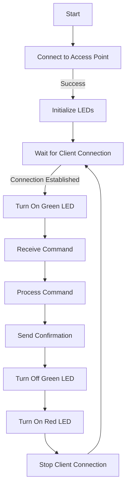

# Client

This repository contains the code for a simple ESP8266-based system that allows you to control LEDs wirelessly via a WiFi connection. The ESP8266 serves as an Access Point (AP), and you can send commands to control the LEDs.

## Getting Started

### Prerequisites

- [Arduino IDE](https://www.arduino.cc/en/software) installed
- ESP8266 board support added to Arduino IDE

### Hardware Setup

1. Connect LEDs to the corresponding pins (`D9` for the red LED and `D10` for the green LED).
2. Power up the ESP8266.

### Software Setup

1. Open the Arduino IDE and load the provided code.
2. Set your WiFi credentials by modifying the `ssid` and `password` variables.
3. Upload the code to your ESP8266.

## Usage

1. Power up the ESP8266.
2. Connect your device to the WiFi network with the specified SSID and password (`ESP8266-AP` and `password` by default).
3. Use a tool like Telnet to connect to the ESP8266's IP address (`192.168.4.1` by default).
4. Send commands (1, 2, or 3) to control the LEDs. The associated data values are predefined in the `processData` function.

## Command Structure

- Command 1: Sets data to 1000
- Command 2: Sets data to 1500
- Command 3: Sets data to 2000

## LEDs Indication

- Green LED on: Indicates the system is operational.
- Red LED on: Indicates standby mode.

## Contributing

Feel free to contribute by submitting issues or pull requests.

## Flowchart

