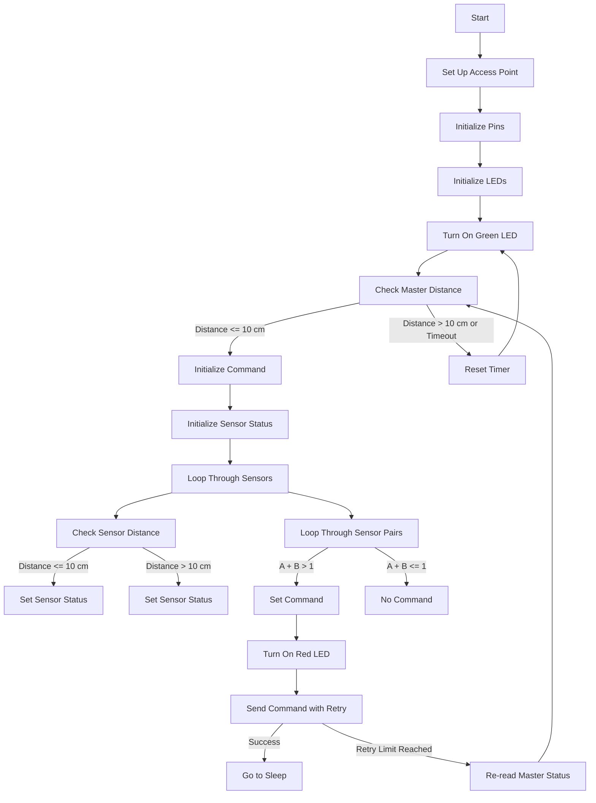

# server

This repository contains the code for an ESP8266-based system that incorporates ultrasonic sensors, buttons, and a switch to control the operation of the device. The ESP8266 operates as an Access Point (AP) and sends commands to another ESP8266 based on sensor readings and button states.

## Getting Started

### Prerequisites

- [Arduino IDE](https://www.arduino.cc/en/software) installed
- ESP8266 board support added to Arduino IDE

### Hardware Setup

1. Connect ultrasonic sensors to the corresponding pins (`D1`, `D2`, `D3`, `D4`) via a multiplexer.
2. Connect buttons to pins `D5`, `D6`, and `D7`.
3. Connect a switch to pin `D8`.
4. Connect LEDs to pins `D9` (red LED) and `D10` (green LED).

### Software Setup

1. Open the Arduino IDE and load the provided code.
2. Set your WiFi credentials by modifying the `ssid` and `password` variables.
3. Set the IP address of the client ESP8266 in the `server_ip` variable.
4. Upload the code to your ESP8266.

## Usage

1. Power up the ESP8266.
2. Connect your device to the WiFi network with the specified SSID and password (`ESP8266-AP` and `password` by default).
3. Use a switch to toggle between button and sensor control modes.
4. In button mode, press buttons 1, 2, or 3 to send corresponding commands.
5. In sensor mode, the system determines the command based on ultrasonic sensor readings.
6. The red LED indicates operation, and the green LED indicates standby.

## Contributing

Feel free to contribute by submitting issues or pull requests.

## License

This project is licensed under the MIT License - see the [LICENSE](LICENSE) file for details.

## Flowchart

